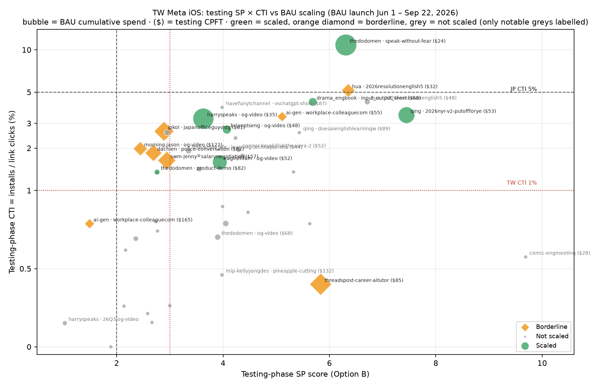

# TW SP score & CTI: Meta app scalability analysis (Jun – Sep 2026 MTD)

Replicates the [JP SP score & CTI Meta app scalability analysis](https://app.notion.com/p/3de792ec2f1080e08811ca3b50186ab0) for Taiwan.
Analysis date: 2026-09-30 (data through 2026-09-29).

## Context
- **Question:** among creatives that graduated from the TW iOS testing campaign into BAU (`…trial_ongoing_winning`,
  `…winning3`, `…scaling2`), which testing-phase metric better predicts which ones actually scale: SP score or
  CTI (click-to-install)?
- **JP result being tested:** a higher SP does not make a creative more likely to scale, while CTI ≥ 5% does.
- **Benchmarks:** SP ≥ 2.0 and CTI ≥ 5% (JP). The TW CPFT target is $55, close to JP's $53, so the JP scaled thresholds are reused unchanged.

## Method
- **Population:** creatives first launched in a TW iOS BAU campaign between 2026-06-01 and 2026-09-22 (so each has a
  complete first week by 9/29) that have at least one ad in the testing campaign
  (`tw_meta_standard_ios_tw-en_pros_purchase_ongoing_no-disc_testing`) that started on or before the BAU launch. That gives **44 creatives**.
- **Excluded:** harryspeaks · 0601 and illyandlean · speak-with-me (no testing-campaign ad).
- **Creative matching:** testing and BAU ads are matched on creator (c6) plus concept (c8) from the ad name, with suffixes like `_scaling`, `-winning`,
  `_c9!app` and image sizes stripped, or on the same video id.
- **Data:**
  - BigQuery `analytics.meta_ads_creative_report_funnel` gives ad × placement × day spend, impressions, clicks, installs and trial starts, for both testing and BAU.
  - Meta Ads MCP (Speak ZH account) gives link clicks for the testing ads, which BigQuery doesn't have. BigQuery spend, clicks and installs reconcile exactly with Meta.
- **SP:** Option B from the SP dashboard skill, computed on the testing campaign (ad × placement, other ads as the benchmark),
  and spend-weighted when a creative had more than one testing ad.
- **CTI:** testing installs ÷ testing link clicks (Meta).
- **Scaled definition (same as JP):** first-week BAU spend > $1,500 AND weekly cost per trial trending down to ≤ $70 (lowest CPR
  in any week with ≥ $1,000 spend). **Borderline:** not scaled, but cumulative BAU spend ≥ $5k (the spend scaled but CPR didn't reach $70
  under the rule).
- **Stats:** Fisher exact test (benchmark vs scaled) and Spearman correlation (metric vs BAU CPR / spend). A creative with 0 BAU trials is
  ranked as the worst CPR.

## Results
**Scaled (7):**
- thedodomen · speak-without-fear ($47k, first-week CPR $40)
- harryspeaks · og-video ($44k, $58 → $55)
- qing · 2026nyr-v2-putoffforyears ($28k; first-week CPR $131, fell to $48–70 from week 2)
- eaglish.fam · og-video ($21k, $68 → $42)
- brianptseng · og-video ($7.8k, $67 → $57)
- drama_engbook · input_output_short ($7.1k, $62)
- thedodomen · product-demo ($3.1k; first week $59, then died at $195 in week 2, so a weak yes)

**Borderline (8):**
- threadspost-career-aitutor ($24.7k at $74)
- jpkol · japanofficeguyvlog ($20k at $98)
- swm-jenny · salarynegotiation ($17k at $77)
- dachien · police-conversation ($14.7k at $84)
- morning.jason · og-video ($10.3k at $121)
- hua · 2026resolutionenglish5m_1full ($9.5k at $62 but only $696 in its first week, a late starter)
- colleaguecompliment_1direct ($5.3k at $98)
- colleaguecompliment_2practice ($5.1k at $131)

### 1. The JP gates do not transfer as-is

| Testing metric | n | Scaled | Scale rate | Median first-wk spend | Median first-wk CPR |
|---|---|---|---|---|---|
| CTI ≥ 5% (JP) | 2 | 1 | 50% | $2,102 | $52 |
| CTI < 5% | 42 | 6 | 14% | $1,884 | $127 |
| SP ≥ 2.0 | 41 | 7 | 17% | $1,742 | $117 |
| SP < 2.0 | 3 | 0 | 0% | $2,055 | $257 |

- TW CTI runs far lower than JP's: the median BAU entrant has CTI of about 1.4%, and only 2 of 44 clear 5%. The CTI ≥ 5% gate is **not significant** (p = 0.30)
  because it's almost empty. It misses 6 of 7 scaled creatives.
- The SP ≥ 2.0 gate has **no discriminating power** (p = 1.0): 41 of 44 BAU entrants already pass it.

### 2. CTI is still the better predictor. The TW cut sits around 1–3%, not 5%

| Testing metric | n | Scaled | Scale rate | Median first-wk spend | Median first-wk CPR | Fisher p |
|---|---|---|---|---|---|---|
| **CTI ≥ 1%** | 25 | 7 | 28% | $2,694 | $98 | **0.014** |
| **CTI < 1%** | 19 | **0** | **0%** | $619 | $174 | |
| CTI ≥ 2.5% | 12 | 5 | 42% | $3,235 | $77 | **0.011** |
| CTI < 2.5% | 32 | 2 | 6% | $1,129 | $134 | |
| SP ≥ 3.0 | 26 | 6 | 23% | $2,172 | $120 | 0.21 |
| SP < 3.0 | 18 | 1 | 6% | $1,423 | $127 | |

CTI threshold sweep:

| CTI cut | n above | scaled | rate | scaled below | p |
|---|---|---|---|---|---|
| 1% | 25 | 7 | 28% | 0/19 | 0.014 |
| 2% | 13 | 5 | 38% | 2/31 | 0.017 |
| 2.5% | 12 | 5 | 42% | 2/32 | 0.011 |
| 3% | 8 | 4 | 50% | 3/36 | 0.014 |
| 5% | 2 | 1 | 50% | 6/42 | 0.30 |

- **CTI ≥ 1% is a clean floor**, like JP's 5%: none of the 19 creatives below it scaled. The TW testing campaign's average CTI
  (Apr–Sep) is 0.80% (3,438 installs ÷ 431,690 link clicks), so 1% roughly means "above-average CTI". **2.5–3% is the precision
  cut:** 42–50% of creatives above it scaled.
- **Spearman correlations:**
  - vs BAU CPR: CTI ρ = −0.46 (p = 0.002); SP ρ = −0.42 (p = 0.005)
  - vs BAU spend: **CTI ρ = +0.57 (p < 0.001)**; SP ρ = +0.26 (p = 0.09, n.s.)
  - vs first-week CPR: **CTI ρ = −0.48 (p = 0.002)**; SP ρ = −0.25 (n.s.)
- Unlike JP, SP does carry some CPR signal in TW: the CTI half of SP is trials per click, which overlaps with CTI. But it doesn't predict
  spend or first-week CPR, and as a gate it filters almost nothing.
- Among the 8 highest-SP creatives (9.69 → 5.63), 3 scaled. The scaled creatives' SP ranges from 2.76 to 7.45. Their CTI ranges from 1.4% to 10.8%, all ≥ 1%.

### Quadrants (TW-calibrated: SP 3.0 × CTI 1%)

| Quadrant | n | Scaled | Rate | Median first-wk spend | Median first-wk CPR | Creatives |
|---|---|---|---|---|---|---|
| High SP × high CTI | 18 | 6 | 33% | $2,618 | $126 | ✅ thedodomen speak-without-fear, harryspeaks og-video, qing 2026nyr, eaglish.fam, brianptseng, drama_engbook input_output · B hua 1full, colleaguecompliment_1direct · ❌ hua 3invest, vschatgpt-short, qing 2humantutor, swm-tsai, connor, emily_life, sophia v2-cut, outro-promo-long, 3750sentences, bigeartv |
| High SP × low CTI | 8 | 0 | 0% | $865 | $115 | B threadspost-aitutor · ❌ comic-engmeeting, pineapple-cutting, thedodomen og-video, thedodomen keep-learning, jenny salary v1, jenny salary v2-cut, qing solo-travel |
| Low SP × high CTI | 7 | 1 | 14% | $8,129 | $85 | ✅ thedodomen product-demo · B jpkol, swm-jenny salary, dachien police, morning.jason · ❌ andrew-founded, christines_talk |
| Low SP × low CTI | 11 | 0 | 0% | $619 | $204 | B colleaguecompliment_2practice · ❌ alicechenlife, harryspeaks 26Q3, amychou, atiendai, chenchensiss, happygang5215, chuchushoetw, cocoinfinland, saraworld, yclife |

With the JP cuts (SP 2.0 × CTI 5%), the quadrants collapse into one cell: 39 of 44 creatives are "high SP × low CTI", and 6 of the 7 scaled creatives are in it.



*Bubble size = cumulative BAU spend · ($) = testing CPFT · green = scaled, orange diamond = borderline, grey = not scaled.*

## Takeaways
- **The hypothesis holds directionally, but the JP threshold doesn't carry over.** CTI beats SP in TW too: it's the only metric that
  predicts BAU spend and first-week CPR, and no creative below 1% CTI scaled. But TW CTI levels are roughly a third of JP's. Using 5% in TW would
  reject 6 of the 7 winners.
- **Proposed TW gate: CTI ≥ 1% as a hard floor, with ≥ 2.5% as the "high-confidence" band.** These cuts were picked from this same sample, so they
  need validating on the next batch of graduates before they become the benchmark.
- **SP ≥ 2.0 filters almost nothing at BAU entry.** Every creative already passed it in testing, so it can't separate winners from the rest.
- **Why SP fails:** SP is inflated by high CTR (pineapple-cutting CTR 5.6%, amychou 8.3%) or by tiny testing samples
  (comic-engmeeting: $55 spend, 2 trials, SP 9.69). The high SP × low CTI quadrant went 0/8 even though several of those creatives had testing CPFTs of $28–77.
- **Low SP × high CTI gets spend but not efficiency.** It includes 4 of the 8 borderlines (jpkol, swm-jenny, dachien, morning.jason, each with $10–20k
  at $77–121). These look like CTR-limited creatives that Meta can still scale.
- **Most high-CTI misses never had a real BAU run.** Of the 12:
  - 6 had minimal first-week delivery (vschatgpt $343, bigeartv $177, 3750sentences $378, qing 2humantutor $999,
    christines_talk $7, swm-tsai $1,127). That's a launch or ad set issue, and they're worth relaunching.
  - The other 6 (hua 3invest, andrew-founded, connor, emily_life, sophia v2-cut, outro-promo-long) spent $2–3.3k in week 1 at CPR
    $117–145 and were cut after one week. Unlike JP, their testing CVR wasn't low (20–50%), so JP's "high CTI + low CVR" fake-hit pattern
    doesn't explain these misses.

## Caveats
- n = 44 with 7 scaled. The TW cuts (1% / 2.5%) were chosen after looking at this data. Re-validate them on the Oct graduates.
- Meta cost per result is in-app trial start (Meta attribution), not AppsFlyer. CTI uses Meta-reported installs.
- Creatives launched after Aug 20 have ≤ 5 weeks of BAU data. The Sep cohort (jenny v2, mip-* whitelist, qing solo-travel) mostly got little delivery.
- Testing-phase metrics use the testing campaign's full history for the matched ads, not a frozen test readout like JP's Creative DB.
  2 creatives were matched to 2 testing ads each (3750sentences, jenny salary v2-cut).
- Scaled definition = the JP rule, so late starters (hua 1full: $9.5k at $62 but only $696 in week 1) count as borderline, not scaled.

## Files
```
queries.sql                     BigQuery extract (creative matching, SP Option B, BAU weekly series) + Meta MCP call
data/creatives.tsv              BigQuery output, one row per BAU creative
data/meta_test_link_clicks.tsv  Meta Ads MCP link clicks / installs / trials for the matched testing ads
analyze.py                      scaled labelling, gates, Fisher / Spearman, sweeps, chart
output/creatives_scored.csv     per-creative table   · output/results.json · output/quadrant.png
```
Rebuild: `python3 analyze.py` (needs pandas, numpy, scipy, matplotlib).
